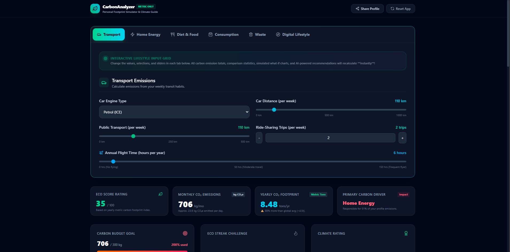
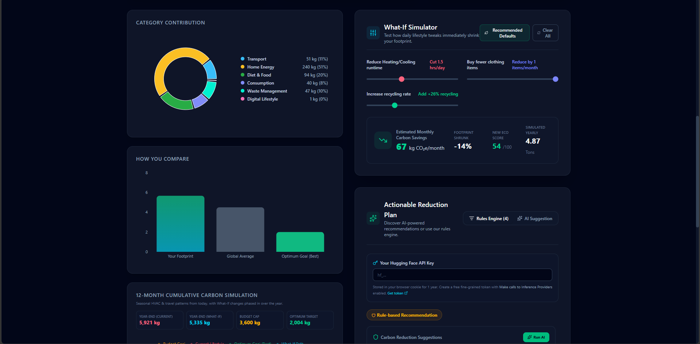
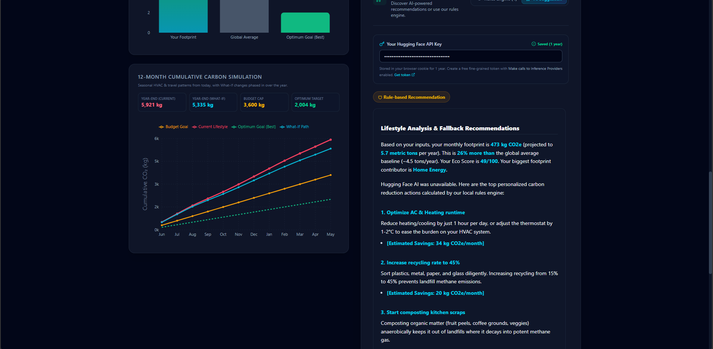
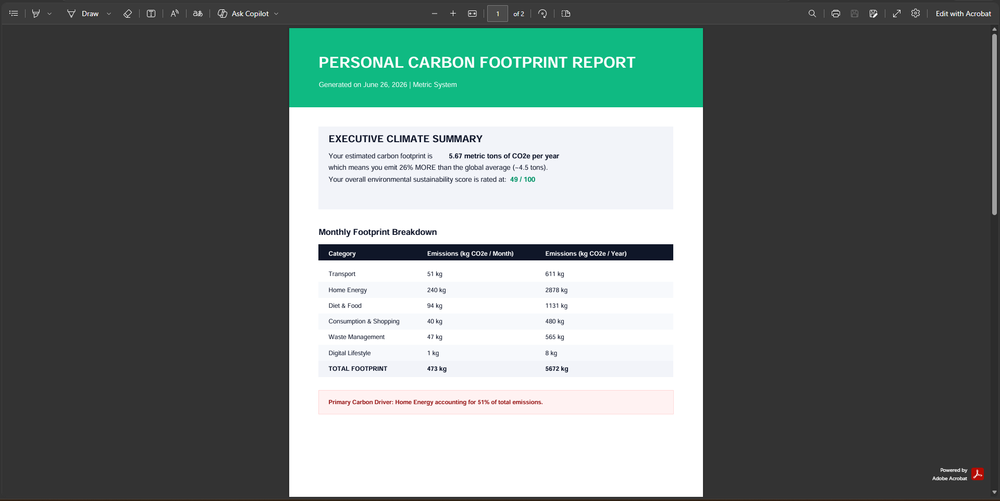
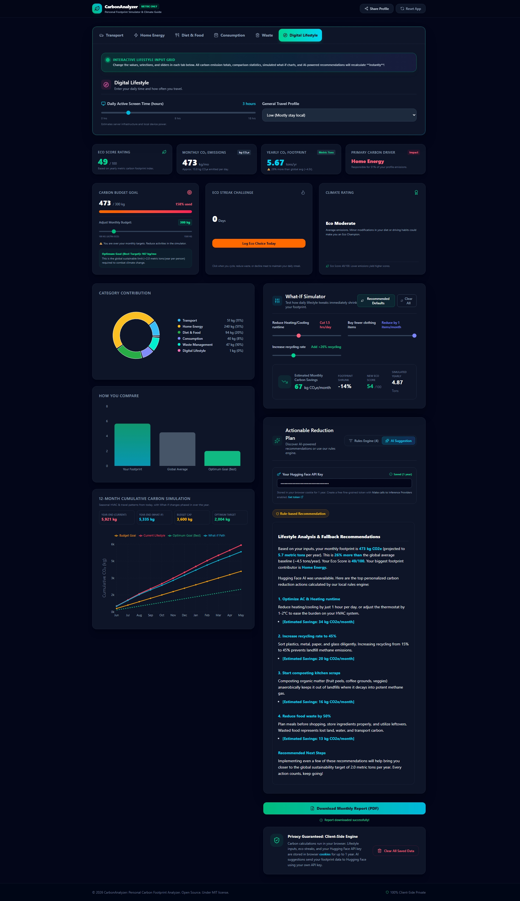

# CarbonAnalyzer: Personal Carbon Footprint Analyzer
---
## Problem Statement

Climate change is one of the most pressing global challenges, and reducing individual carbon emissions is essential for achieving a more sustainable future. However, most people are unaware of how their everyday activities—such as transportation, electricity consumption, diet, shopping habits, waste generation, and digital device usage—contribute to their overall carbon footprint.

Existing carbon footprint calculators often provide only a final emission value without offering meaningful explanations or personalized guidance. As a result, users struggle to identify the activities that have the greatest environmental impact and are uncertain about the most effective actions they can take to reduce their emissions.

The Personal Carbon Footprint Analyzer addresses this problem by enabling users to estimate their carbon footprint based on their lifestyle choices. The application provides a detailed category-wise breakdown of emissions, an Eco Score, interactive visualizations, AI-powered personalized recommendations, a what-if simulator for exploring sustainable alternatives, and downloadable reports. By transforming complex environmental data into practical and actionable insights, the system encourages users to make informed decisions that contribute to a lower carbon footprint and a more sustainable lifestyle.

---
## Solution

CarbonAnalyzer is an AI-powered web application that helps users estimate, visualize, and reduce their personal carbon footprint based on everyday lifestyle choices.

The application analyzes emissions across six major categories: transportation, home energy, food consumption, shopping habits, waste management, and digital lifestyle. It provides users with:

- Accurate carbon footprint calculations
- Interactive visualizations and trend analysis
- AI-powered personalized sustainability recommendations
- A What-If Simulator to evaluate lifestyle changes
- Carbon budget tracking and Eco Score
- Professional PDF reports for sharing and record keeping

Unlike traditional carbon calculators, CarbonAnalyzer combines environmental analytics with AI-driven insights to help users make informed and practical decisions toward sustainable living.

An elegant, modern web application built with **Next.js 16, TypeScript, Tailwind CSS (v4)**, and **Recharts** to help individuals compute, simulate, and reduce their lifestyle greenhouse gas emissions.

The app features dynamic visual breakdowns, a seasonal **12-Month Cumulative Carbon Simulation**, an interactive **What-If Simulator**, carbon budget tracking, goal/streak systems, profile sharing, vector PDF reporting, and **AI-powered carbon reduction suggestions** via Hugging Face — with a local rule-based engine as fallback.

All footprint math runs **entirely in the browser**. Lifestyle data is stored in cookies; AI requests are proxied through a single Next.js API route using the user's own Hugging Face API key.

---
## Why AI Agents?

CarbonAnalyzer uses an AI recommendation agent to transform carbon footprint calculations into personalized sustainability guidance.

The agent:

- Analyzes the user's lifestyle and emission profile.
- Identifies the highest contributing emission categories.
- Generates customized reduction strategies.
- Explains recommendations in natural language.
- Suggests realistic lifestyle improvements.

If AI services are unavailable, the application automatically switches to a built-in rule-based recommendation engine, ensuring users always receive actionable advice.

---

## System Architecture

```text
                     User
                       │
                       ▼
           Lifestyle Questionnaire
                       │
                       ▼
          Carbon Calculation Engine
                       │
        ┌──────────────┴──────────────┐
        ▼                             ▼
   Emission Factors          AI Recommendation Agent
        │                             │
        └──────────────┬──────────────┘
                       ▼
      Charts • Eco Score • PDF Report
```

---

## Future Improvements

- Mobile application
- User authentication
- Historical carbon footprint tracking
- Community challenges
- Renewable energy recommendations
- Carbon offset marketplace integration
- Multi-language support

---

## How It Works

1. User enters lifestyle information.
2. Carbon emissions are calculated locally.
3. Eco Score is generated.
4. Charts visualize emissions.
5. AI Agent creates personalized recommendations.
6. User explores improvements using the What-If Simulator.
7. PDF report can be exported.

---

## Key Features

* **Comprehensive Lifestyle Questionnaire** — Six tabbed sections with instant recalculation on every change:
  * **Transport** — Weekly driving distance & fuel type (petrol / diesel / electric / none), public transit, annual flight hours, ride-share trips.
  * **Home Energy** — Monthly electricity (kWh) with regional grid factor, cooking LPG (kg), AC/heating hours per day.
  * **Diet & Food** — Beef, chicken, vegetarian meals per week, vegan days, food waste (kg/week).
  * **Consumption** — Clothing purchases per month, electronics per year, shopping frequency (low / medium / high).
  * **Waste** — Weekly waste (kg), recycling rate (%), composting toggle.
  * **Lifestyle & Goals** — Daily device screen time, travel frequency level, and personal monthly carbon budget goal.
* **Metric-Only Standard** — International SI / metric units: `kg CO₂e`, `km`, `kWh`, `kg food`, and `liters`.
* **Executive Dashboard Metrics** — Eco Score (0–100), monthly emissions, projected yearly footprint (metric tons), global-average comparison, and primary carbon-driving category.
* **Carbon Budget & Climate Rating** — Adjustable monthly budget slider (100–1,500 kg CO₂e), progress bar, optimum target callout (~167 kg/mo), and tiered climate rating (Eco Champion / Eco Moderate / High Footprint).
* **Data Visualizations (Recharts)**:
  * *Pie Chart* — Category weight percentage across six emission areas.
  * *Bar Chart* — Your footprint vs global average (~4.5 tons/year) vs optimum sustainability target (~2.0 tons/year).
  * *Line Chart* — **12-Month Cumulative Carbon Simulation** with seasonal HVAC/travel modeling, budget goal, optimum target, and a phased What-If path.
* **What-If Simulator** — Six interactive sliders (reduce driving, shift to transit, meat-free meals, HVAC reduction, fewer clothing purchases, higher recycling) with **Recommended** and **Clear** presets. Changes instantly recalculate emissions and update the simulation chart.
* **AI Suggestions** — Personalized reduction plans from Hugging Face LLMs (`Qwen/Qwen2.5-7B-Instruct` with fallbacks). Users supply their own API key in the UI. Responses show a source badge (AI vs rules).
* **Rules Engine Fallback** — Local, category-tagged recommendations with estimated monthly savings when AI is unavailable or no API key is set.
* **Gamified Eco Streaks** — Log daily eco choices to build a consecutive-day streak (stored in cookies; resets if a day is missed).
* **Share Profile** — One-click copy of a shareable URL encoding lifestyle inputs (`?data=` query param; excludes monthly budget goal).
* **Reset App** — Header button to clear all saved cookies and restore defaults.
* **Vector PDF Exporter** — Downloads a 2-page A4 report (executive summary + inputs & suggestions) via `jsPDF`.
* **Cookie-Based Persistence** — Lifestyle inputs, streak data, and Hugging Face API keys are stored in browser cookies for **up to 1 year**. Includes **Clear All Saved Data** in the privacy panel.

---

## Tech Stack

* **Framework**: Next.js 16 (App Router, React 19)
* **Language**: TypeScript
* **Styling**: Tailwind CSS v4 (dark glassmorphic theme)
* **Icons**: Lucide React
* **Charts**: Recharts
* **PDF**: jsPDF
* **AI**: `@huggingface/inference` (chat completion)

---

## Project Structure

```text
├── public/
│   ├── 0.png
│   ├── 1.png
│   ├── 2.png
│   ├── 3.png
│   ├── 4.png
│   ├── 5.png
│   ├── 6.png
│   ├── 7.png
│   ├── 8.png
│   ├── 9.png
│   ├── 10.png
│   ├── 11.jpeg
├── public/
│   ├── file.svg
│   ├── globe.svg
│   ├── next.svg
│   ├── vercel.svg
│   └── window.svg
├── src/
│   ├── app/
│   │   ├── api/suggestions/route.ts   # Proxies AI requests using the user's HF token
│   │   ├── favicon.ico                # App icon
│   │   ├── globals.css                # Tailwind v4 theme & glassmorphic utilities
│   │   ├── layout.tsx                 # Root layout & page metadata
│   │   └── page.tsx                   # Main dashboard & state coordinator
│   ├── components/dashboard/
│   │   ├── DashboardForm.tsx          # Six-tab lifestyle questionnaire
│   │   ├── CarbonCharts.tsx           # Pie, bar, and 12-month line charts
│   │   ├── WhatIfSimulator.tsx        # Interactive reduction sliders
│   │   ├── AiRecommendations.tsx      # HF API key input + AI / rules tabs
│   │   ├── GoalAndStreakTracker.tsx   # Monthly budget goal, eco streak, climate rating
│   │   ├── PdfExporter.tsx            # 2-page jsPDF report generator
│   │   └── PrivacyInfo.tsx            # Privacy notice & clear-data control
│   └── utils/
│       ├── carbonCalculator.ts        # Footprint formulas & Eco Score
│       ├── carbonSimulation.ts        # Seasonal 12-month cumulative model
│       ├── carbonConstants.ts         # Global averages & optimum targets
│       ├── cookies.ts                 # 1-year cookie helpers
│       ├── emissionFactors.ts         # Regional grid & category coefficients
│       └── ruleSuggestions.ts         # Local rules engine
├── .env.example                       # Optional server defaults (HF_MODEL, HF_API_ENDPOINT)
├── .gitignore
├── eslint.config.mjs
├── next.config.ts
├── next-env.d.ts
├── package.json
├── postcss.config.mjs
└── tsconfig.json
```

---

## Application Layout

The single-page dashboard (`page.tsx`) is organized in four rows:

1. **Lifestyle Questionnaire** — Full-width `DashboardForm` with tabbed inputs.
2. **Executive Metrics** — Four cards: Eco Score, Monthly CO₂e, Yearly Footprint, Primary Carbon Driver.
3. **Profile Tracker** — `GoalAndStreakTracker` (budget progress, streak challenge, climate rating).
4. **Analysis Column** — Left: `CarbonCharts`. Right: `WhatIfSimulator`, `AiRecommendations`, `PdfExporter`, and `PrivacyInfo`.

---

## 12-Month Cumulative Carbon Simulation

The line chart is powered by `carbonSimulation.ts` and models:

1. **Seasonal variation** — Higher energy use in summer/winter (HVAC) and transport peaks around holidays.
2. **Flight distribution** — Annual flight hours spread across peak travel months via `FLIGHT_MONTH_SHARE`.
3. **Rolling calendar** — Month labels start from the current month (e.g. Jun → May).
4. **Four cumulative paths**:
   * **Current Lifestyle** (red) — Your profile with seasonal adjustments.
   * **What-If Path** (cyan) — Phased adoption of What-If Simulator changes over 12 months (ease-out adoption curve).
   * **Budget Goal** (amber) — Your personal monthly carbon budget × months elapsed.
   * **Optimum Goal (Best)** (green dashed) — ~167 kg/month (~2.0 metric tons/year).

Year-end summary cards above the chart show projected totals for each path.

---

## Hugging Face AI Integration

AI suggestions call `POST /api/suggestions`, which forwards your lifestyle data to Hugging Face using **your own API key** (from the request body or `Authorization: Bearer` header).

### Setup (user-provided key)

1. Create a free [fine-grained Hugging Face token](https://huggingface.co/settings/tokens/new?ownUserPermissions=inference.serverless.write&tokenType=fineGrained) with **Make calls to Inference Providers** enabled.
2. Open the app → **Actionable Reduction Plan** panel.
3. Paste your token (`hf_...`) in **Your Hugging Face API Key**. It is saved in a cookie for 1 year.
4. Click **AI Suggestion** or **Run AI**.

The API route tries models in order: `Qwen/Qwen2.5-7B-Instruct`, `meta-llama/Llama-3.1-8B-Instruct`, then `HuggingFaceH4/zephyr-7b-beta`. Override the preferred model with optional server env `HF_MODEL`. Optionally point to a custom inference endpoint via `HF_API_ENDPOINT`.

### Fallback behavior

| Condition | Result |
|-----------|--------|
| No API key entered | Error prompt; use **Rules Engine** tab |
| Invalid / expired token | Error message; rules fallback on failure |
| All models timeout (25s each) | Rule-based markdown returned with `source: "rules"` |
| Success | AI markdown with `source: "ai"` |

**Privacy note:** AI requests send your footprint `inputs` and `results` to Hugging Face via the Next.js API route. Carbon math itself runs entirely in the browser.

---

## Privacy & Data Storage

| Data | Cookie Key | Duration |
|------|------------|----------|
| Lifestyle questionnaire (incl. monthly goal) | `carbon_analyzer_user_inputs` | 1 year |
| Eco streak count | `carbon_analyzer_eco_streak` | 1 year |
| Last streak log date | `carbon_analyzer_eco_last_logged` | 1 year |
| Hugging Face API key | `carbon_analyzer_hf_token` | 1 year |

No accounts, databases, or server-side user storage. Use **Clear All Saved Data** (privacy panel) or **Reset App** (header) to wipe all cookies.

Profile sharing encodes inputs in the URL `?data=` query param (excludes `monthlyGoal` to keep URLs compact).

---

## Local Development

```bash
npm install
npm run dev
```

Open [http://localhost:3000](http://localhost:3000).

Optional `.env.local` (server defaults only — **not required** for AI if users provide their own key):

```bash
# Optional preferred model
HF_MODEL=Qwen/Qwen2.5-7B-Instruct

# Optional custom inference endpoint (omit for default Hugging Face router)
# HF_API_ENDPOINT=
```

---

## Build & Deploy

```bash
npm run build
npm start
```

### Vercel

1. Import the GitHub repository on [Vercel](https://vercel.com).
2. Framework preset: **Next.js**.
3. Environment variables are **optional** (`HF_MODEL`, `HF_API_ENDPOINT`). Users bring their own Hugging Face API keys.
4. Deploy.

---

## Core Calculations

Computed locally in `carbonCalculator.ts` using coefficients from `emissionFactors.ts`:

### Transport
* Petrol: `0.192 kg CO₂e/km` · Diesel: `0.171` · Electric: `0.053`
* Public transit blend (bus + train): `0.073 kg CO₂e/km`
* Aviation: `150 kg CO₂e/hour` · Ride-share: `0.120 kg CO₂e/km` (8 km avg trip)
* Travel frequency multiplier: low `0.8` · medium `1.0` · high `1.3`

### Home Energy
* Regional electricity factors: Global `0.475`, India/China `0.750`, US `0.370`, EU `0.250`, Canada `0.120`, France `0.050` (kg CO₂e/kWh)
* LPG: `2.98 kg CO₂e/kg` · HVAC estimated at `1.5 kW` × regional grid factor × hours/day

### Diet & Waste
* Beef meal (150g portion): `4.05 kg CO₂e` · Chicken: `1.04` · Vegetarian: `0.80`
* Food waste: landfill factor + `2.0 kg CO₂e/kg` production multiplier
* Landfill: `1.9 kg CO₂e/kg` · Recycling credit: `-0.6 kg CO₂e/kg` diverted · Compost credit: `-0.2 kg CO₂e/kg` (≈30% of waste)

### Consumption & Lifestyle
* Clothing: `12.5 kg CO₂e/item` · Electronics: `150 kg CO₂e/device/year`
* Shopping level: low `15` · medium `50` · high `120` kg CO₂e/month
* Device screen time: `0.007 kg CO₂e/hour`

### Eco Score
Exponential decay on yearly total (scale ~8 metric tons); 100 = excellent, 0 = very high footprint.

---

## Screenshots

### Dashboard


### Carbon Analysis


### AI Recommendations


### What-If Simulator


### PDF Report


### Complete Dashboard


---

## License

MIT
